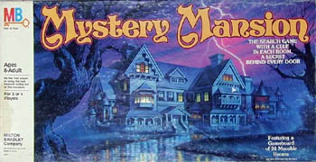
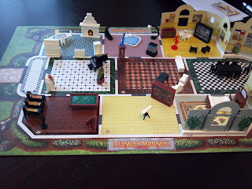
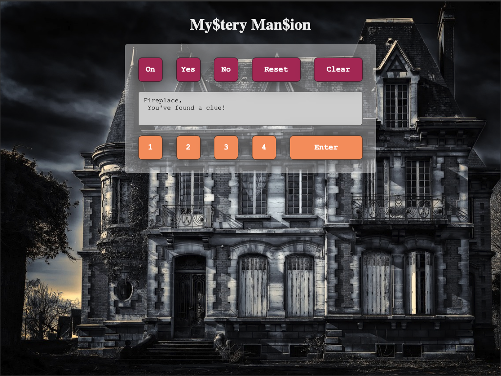

# My$tery Man$ion Electronic Organizer

A browser version of the 1996 Hasbro My$tery Man$ion electronic organizer.

This project is a recreation of the 1996 Hasbro My$tery Man$ion electronic organizer game, implemented as a browser-based game. It aims to capture the nostalgic experience of the original game while providing a modern and accessible version for new audiences to enjoy.

An extensive history of the game can be found on [Wikipedia](<https://en.wikipedia.org/wiki/Mystery_Mansion_(board_game)>).

## Table of Contents

1. [Objective](#objective)
2. [Set Up](#set-up)
3. [Game Play](#game-play)
4. [Code Functionality](#code-functionality)
5. [Project Features](#project-features)
6. [Development Process](#development-process)
7. [Future Improvements](#future-improvements)
8. [Technologies Used](#technologies-used)
9. [Acknowledgments](#acknowledgments)
10. [Contact Information](#contact-information)

## Objective

Search millionaire B. Emmet Redstone's mansion and be the first to find the million dollars he has hidden in a piece of furniture. To win, you must:

1. Discover the particular piece of furniture it's hidden in.
2. Prove that you have collected the two Clue Cards (one item and one person) you will be asked to present-the Map, Letter, Tape, or Photos; and the Cook, Butler, Maid, or Chauffeur.

If you have found the correct piece of furniture and you hold the correct combination of Clue Cards, you win the fortune!

## Set Up

In this game, the board layout remains constant, but the contents of the rooms change. Players can search for any item they choose. An electronic organizer provides clues, with some information shared among all players and some only given to the active player. By deducing the location of the money based on these clues, players must collect the correct clue cards (one item and one person) out of the 12 possibilities to win the game.

The Mystery Mansion game comes with a game board, cardboard walls, an electronic organizer, 35 pieces of furniture, 4 boy and 4 girl game play pieces, 10 clue cards, 9 turn cards, and 2 dice.

Set the furniture to one side of the game board, where everyone can reach it.

Each player selects a mover and puts it in the tiled foyer, just inside the front entrance. You all start your explorations from here. The entrance does not count as a "room", and there are no clues hidden here.

Pick a player to go first. Play passes to the left.

Game Board [[_Image Source_]](http://aboardgameaday.blogspot.com/2012/02/mystery-mansion.html)

## Game Play

> There are 3 things you can do on every turn, so decide if you will MOVE, LOOK and/or TALK. It's up to you which combination of those actions you choose.

Press the ON button. You will hear, "Welcome." If "Continue?
Y/N" appears on the screen, press YES.

First action:

1. MOVE from the Entrance foyer through the doorway into the first room; it's room #11. (If you are using the Turn Cards, put a "Move" Card face up in front of you.)

1. Key the number 11 into the Electronic Organizer, press ENTER, and listen as Redstone tells you what furniture goes in the room. If you need to hear the list again, press REPEAT, and Redstone will repeat it.

1. Arrange those pieces of furniture in the room however you want.

Second action:

1. Now you may LOOK for a Clue! (Put a "Look" card in front of you if you wish.) Pick up any piece of furniture in Room #11 and read its number with the magnifier.

1. Key that number into the Organizer and press Enter. What did you hear? (See under "LOOK," page 6.) If you want, make a note of what you learn.

Third action:

1. You have two options. You may LOOK at a second piece of furniture in the same room and get another clue, OR you may MOVE into an adjacent room (next door) and furnish it. (Whichever you do, you may play the appropriate Turn Card if you wish.)

1. Your first turn is over.

All subsequent players: The first part of your first turn must be to MOVE into Room #11, but do not key the number into the Organizer, since the first player has already furnished that room.
When the first part of your turn is over and you have made a MOVE inside the mansion, what you do next is up to you!

## Code Functionality

1. **Initialization**:

    - Initializes various arrays and objects containing information about rooms, furniture, clues, etc.

2. **Game Functions**:

    - `startGame`: Initiates the game by setting up initial conditions and event listeners for button clicks.
    - `enterCode`: Handles user inputs, such as entering numbers, clearing the screen, or submitting codes.
    - `look`: Processes entered codes and displays relevant information about rooms or furniture.
    - `dressRooms`: Displays the contents of a room if it's not locked.
    - `unlockRooms`: Unlocks a locked room based on user input.
    - `theFurniture`: Displays information about selected furniture and checks for hidden clues.
    - `secretMessage`: Displays secret messages or hints based on certain conditions.
    - `hiddenClues`: Reveals hidden clues in furniture items.

3. **Game Setup Functions**:

    - `lockedRooms`: Determines which rooms are initially locked.
    - `Money`: Determines the location and conditions for obtaining the money in the game.
    - `trapDoor`: Determines which furniture leads to a trap door.
    - `clueItems`: Determines which furniture items contain clues.
    - `secretMessageItems`: Determines which furniture items contain secret messages.

4. **Utility Functions**:

    - `resetGame`: Resets the game state.
    - `sleep`: Pauses execution for a specified duration.
    - `randomRooms`: Randomizes the arrangement of rooms.

5. **Other Functions**:
    - `letsTalk`, `move`: Placeholder functions with no current functionality.

## Project Features

-   Browser-based recreation of the 1996 My$tery Man$ion electronic organizer game.
-   Interactive game board with changing room contents.
-   Use of an electronic organizer for providing clues and game instructions.
-   Ability to search for items in different rooms of the mansion.
-   Includes 35 pieces of furniture, 4 boy and 4 girl game play pieces, 10 clue cards, 9 turn cards, and 2 dice.

## Development Process

-   Started as a personal project to recreate a childhood favorite game.
-   Implemented using HTML, CSS, and JavaScript.
-   Faced challenges in replicating the electronic organizer's functionality and providing an engaging gameplay experience.
-   Overcame challenges through experimentation, research, and iterative development.

## Future Improvements

-   Implement a randomization of rooms to keep the game play fresh.
-   Implement a clear end game scenario where players must correctly identify the piece of furniture containing the money.

## Technologies Used

-   HTML5
-   CSS3
-   JavaScript

## Acknowledgments

-   Hasbro for creating the original My$tery Man$ion game.
-   Wikipedia for providing detailed information about the game's history and rules.
